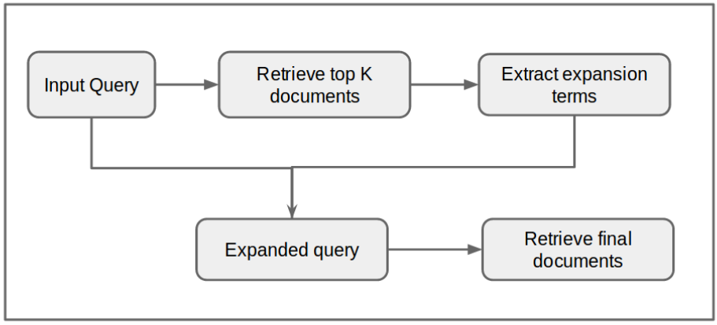

## Proyecto de Sistema de Información       
### Modelo Vectorial Generalizado
Curso 2018-2019

>>**Resumen:** Sistema de Recuperación de Información(SRI) basado en el modelo vectorial generalizado, programado en python. El SRI está compuesto por los 4 módulos fundamentales: Procesamiento de Texto, Modelado, Index e Interfaz. Se implementaron como funcionalidades extras: Crawling, Expansión de consulta y Recomendación de documentos. Estos módulos son independientes entre sí, los cuales se comunican entre sí haciendo uso de la biblioteca json, lo que permite escalar fácilmente y mejorar el rendimiento. Con el objetivo de evaluar el SRI fueron implementados los criterios de evaluación pertinentes.

**Keywords:** sistema de recuperación de información, modelo vectorial generalizado, crawling, expansion de consulta, index, json.

#### 1. Requerimientos de software
        Python 3.7 
        PyQt 5
        nltk 3.0
        sklearn

#### 2. Interfaz Visual
> El objetivo de este módulo es ofrecerle al usuario una manera fácil de interactuar con el SRI. Para construir este módulo nos apoyamos en ***PyQt5***. ***PyQt5*** es una herramienta que permite construir interfaces gráficas de una manera relativamente fácil dado que cuenta con un diseñador y convierte el diseño a código python donde luego programamos la lógica. Nuestro diseño cuenta con dos pestañas principales, elección del repositorio(local search, web search) y consulta. 

> La pestaña designada a la elección del repositorio permite al usuario escoger entre hacer una búsqueda local en su computadora o una búsqueda con información de la web, para esta última, el usuario puede escoger el sitio o los sitios web en la red de los cuales quiere hacer recuperación de información, así como la profundidad de navegación por los links de estas páginas. La siguiente pestaña es donde el usuario va a realizar su consulta y posteriormente evaluar el modelo, teniendo la oportunidad de seleccionar de entre todos los documentos aquellos que considere relevantes.
>
#### 3. Crawling

#### 4. Procesamiento de Texto
>Para poder implementar mecanismos de recuperación sobre una colección de documentos de texto es necesario obtener una representación de los mismos. Con el objetivo de lograr dicha representación seguimos un conjunto de pasos para dejar solo los términos de los textos que van hacer útil para la posterior recuperación de información, lo cual además, hace muy mucho más rápido el trabajo con el modelo. 

>Haciendo uso de la librería ***re*** de python para el trabajo con patrones en strings, reemplazamos todos las posibles contracciones que se utilizan en el idioma inglés por su respectiva forma correcta(Ejemplo: you're--you are, aren't-- are not), luego utilizando nltk eliminamos todas las stopwords(palabras que no aportan significado) y signos de puntuaciones. Haciendo uso de la biblioteca ***langdetect*** de python averiguamos el idioma del texto o de la consulta para un mejor ***stemming*** utilizando la clase ***SnowballStemmer*** de ***nltk***, la cual nos reduce en gran medida la cantidad de términos con los que vamos a trabajar. Devolviendo una lista de tokens, para su posterior utilización.

#### 5. Expansión de Consulta
>#### 5.1 Expansion de Consultas basado en WordNet

>> WordNet is a lexical database for multiple languages. The similar terms from multiple languages are connected via synsets (set of senses). WordNet can be used to fetch re-lated term for a particular term in multiple languages and can help in satisfying user’s information need.

>>Por lo que apoyándonos en WordNet, agregamos a la consulta inicial del usuario aquellas palabras que presenten mayor similaridad con los términos de la consulta.

>#### 5.2 Expansion de Consultas basado en Relevance FeedBack 
>>Relevance feedback based methods execute the initial query on collection and extract top k documents. Then the ranked document are used to improve the performance of retrieval. It is assumed that the initial retrieved documents are relevant and thus can be used to extract expansion terms. These models fail when the initial retrieval algorithm of search engine is poor.

>>#### 5.2.1 Pseudo Relevance FeedBack (PRF)
>>> In Pseudo Relevance Feedback based models initial query is fired and top k results are obtained. Then important terms, mostly based on co-occurrence, from these documents are extracted and added to query. Then this expanded query is re fired to retrieve final set of documents which are made available to the user. The relevancy of expansion terms depends upon the initial retrieved documents. En la siguiente imagen vemos representado este esquema:

>>>

#### 6. Modelado

#### 7. Index
>El módulo Index fue implementado utilizando un diccionario privado. Este se encarga de almacenar de una manera eficiente toda la información que a la postre utilizará el SRI. Tenemos como método principal ***start (json_request)*** cuya función es recibir todas las entradas en formato ***json*** y llamar a los métodos pertinentes. En nuestro caso además de los métodos obligatorios implementamos un método llamado ***__all_term_doc(doc)*** que devuelve todos los términos que pertenecen a ese documento. La estructura de nuestro diccionario queda de la siguiente forma:
```python
index = {'term1': {'idf': 0.3,
                  'documents':{
                               {'doc1':{'tf':0.5,
                                        'weight':0,
                                        'minterm': 010..00
                                        }
                               {'doc2':{'tf':0.5,
                                        'weight':0,
                                        'minterm': 0110..00
                                        }
                               },
                    'index_in_vector': 5
                    }
         'term2': {'idf': 0.3,
                  'documents':{
                               {'doc1':{'tf':0.5,
                                        'weight':0,
                                        'minterm': 010..00
                                        }
                               {'doc2':{'tf':0.5,
                                        'weight':0,
                                        'minterm': 0110..00
                                        }
                               },
                    'index_in_vector': 6
                    }
           ...         
        }

```


#### 8. Medidas de Evaluación
Dado que existen sistemas basados en diferentes modelos y algoritmos, se necesitan criterios que permitan medir los parámetros de funcionamiento que valoran al sistema y además posibiliten la comparación entre distintos SRI. Para nuestro modelo implementamos las siguientes medidas de evaluación:
- Precisión
- Recobrado
- F-Medida
- E-Medida
- R-Precisión

Estas medidas pueden ser calculadas por el usuario una vez halla realizado la consulta, tal como se muestra en la interfaz visual.

#### 9. Referencias
1. Baeza-Yates, R., Ribeiro-Neto, B.: Modern Information Retrieval. Addison-Wesley Longman Publishing Co., Inc., Boston, MA, USA (1999)
2. Mills J. Y Keen M Cleverdon, C.W. Factors determining the performance of indexing systems. ASLIB Cranfield Project. Vol. 1, Design, Vol2, Test Results, 1996. 